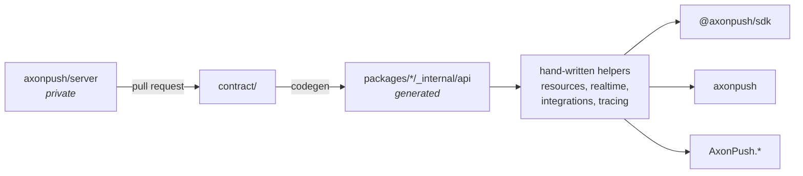

# axonpush SDKs

Every public axonpush client, generated from one contract.

| package | registry | source |
|---|---|---|
| [`@axonpush/sdk`](https://www.npmjs.com/package/@axonpush/sdk) | npm | [`packages/typescript`](packages/typescript) |
| [`axonpush`](https://pypi.org/project/axonpush/) | PyPI | [`packages/python`](packages/python) |
| `AxonPush`, `AxonPush.Otel`, `AxonPush.SemanticKernel` | NuGet | [`packages/dotnet`](packages/dotnet) |

## How this fits together



`contract/` is generated by the server and arrives here as a pull request. Do
not hand-edit it. The generated client layer under each package's `_internal/`
is likewise off limits; change the server, let the contract follow, and let
codegen do the rest.

What you *do* write by hand is the layer on top: the resource classes, the
realtime client, the framework integrations, the error tree. Those are what
make the SDK pleasant rather than merely correct.

## Getting started

```
mise install     # bun, node, python, uv, dotnet
mise run install
mise run check   # lint, typecheck, test, parity
```

`mise run codegen` regenerates every client from `contract/`. It needs no
running backend.

## Keeping the SDKs honest

The two SDKs are deliberate mirrors of each other, and used to drift because
nothing compared them. Now:

- **`tools/surface-diff.ts`** compares the resource surfaces across languages,
  normalising for naming convention. It found `channels.list` missing from
  Python and `cancelInvitation` missing from TypeScript on its first run.
- **`tools/check-versions.ts`** asserts each package states one version. It
  found `@axonpush/sdk` shipping 0.0.7 with `src/version.ts` saying 0.0.6.
- **`contract/fixtures/`** pins the parts of the contract OpenAPI cannot carry:
  the MQTT topic grammar, the webhook HMAC scheme, header names, and the
  `AXONPUSH_*` surface with units. Each SDK replays them as conformance tests.
- **`codegen-clean`** fails CI if a checked-in client no longer matches the
  contract.

## Releasing

Tags are namespaced per package, because `v0.0.6` means three different things
across these histories:

```
sdk-ts-v0.0.8       ->  npm
sdk-py-v0.0.15      ->  PyPI
sdk-dotnet-v0.1.0   ->  NuGet
```

All three publish through trusted publishing: the workflow's OIDC identity is
exchanged for a credential that expires in minutes, so there is no registry
token stored anywhere and nothing to rotate. npm attaches provenance
automatically as a result.

Each publish workflow refuses to run if the tag disagrees with the version in
the package manifest. Versions are independent: the Python SDK moving is no
reason for the .NET one to.

Changelogs are hand-written, one per package.

## History

This repo is the merge of `axonpush/ts-sdk`, `axonpush/python-sdk` and
`axonpush/dotnet-sdk`, imported with `git filter-repo` so per-file history
survives. `git log packages/typescript/src/client.ts` reaches back to the
original first commit. The old repos are archived, and their original tags stay
resolvable there as the provenance for anything already published.
