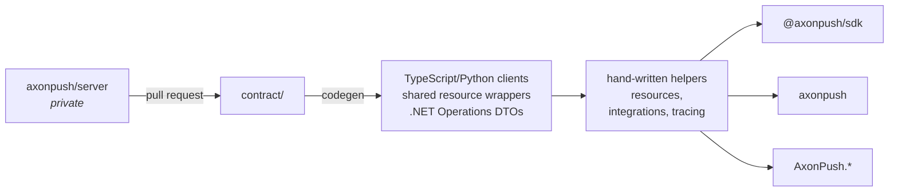

# axonpush SDKs

Every public axonpush client, generated from one contract.

| package | registry | source |
|---|---|---|
| [`@axonpush/sdk`](https://www.npmjs.com/package/@axonpush/sdk) | npm | [`packages/typescript`](packages/typescript) |
| [`axonpush`](https://pypi.org/project/axonpush/) | PyPI | [`packages/python`](packages/python) |
| `AxonPush`, `AxonPush.Otel`, `AxonPush.SemanticKernel` | NuGet | [`packages/dotnet`](packages/dotnet) |

See [Business operations](AGENT_OPERATIONS.md) for the shared workspace,
template, observation and activity contract. Model routing and business decisions
remain in the source application; the SDK observes their metadata.

## How this fits together


```mermaid
flowchart LR
    S["axonpush/server<br/><i>private</i>"] -- pull request --> C["contract/"]
    C -- codegen --> G["TypeScript/Python clients<br/>shared resource wrappers<br/>.NET Operations DTOs"]
    G --> H["hand-written helpers<br/>resources,<br/>integrations, tracing"]
    H --> N["@axonpush/sdk"]
    H --> P["axonpush"]
    H --> D["AxonPush.*"]
```

`contract/` is generated by the server and arrives here as a pull request. Do
not hand-edit it. The generated client layers and .NET `Operations/*.g.cs` DTOs
are likewise off limits; change the server, let the contract follow, and let
codegen do the rest.

Business operation wrappers are generated with `tools/generate-operations.py`.
What you write by hand is the layer on top: framework integrations, resource
helpers and the error tree. Those are what make the SDK pleasant
rather than merely correct.

## Getting started

```
mise install     # bun, node, python, uv, dotnet
mise run install
mise run check   # lint, typecheck, test, parity
```

`mise run codegen` regenerates every client from `contract/`. It needs no
running backend.

## Keeping the SDKs honest

Python and TypeScript resource surfaces are mirrored; shared business operations
also cover .NET. The following checks keep them aligned:

- **`tools/surface-diff.ts`** compares the resource surfaces across languages,
  normalising for naming convention. It found `channels.list` missing from
  Python and `cancelInvitation` missing from TypeScript on its first run.
- **`tools/check-versions.ts`** asserts each package states one version. It
  found `@axonpush/sdk` shipping 0.0.7 with `src/version.ts` saying 0.0.6.
- **`tools/check-contract.ts`** verifies the mirrored contract digest and operation
  list, and that all business operations have resource wrappers in all languages.
  `packages/typescript/tools/check-resource-contract.ts` also checks each facade’s
  body/query/path aliases against its generated operation.
- **`contract/fixtures/`** pins the parts of the contract OpenAPI cannot carry:
  the webhook HMAC scheme, header names (including `X-API-Key` for `ak_` keys
  and `X-Public-Token` for `pt_` public ingest tokens), and the `AXONPUSH_*`
  surface with units. Each SDK replays them as conformance tests.
- **`codegen-clean`** fails CI if a checked-in client no longer matches the
  contract.

## Releasing

Tags are namespaced per package, because `v0.0.6` means three different things
across these histories:

```
sdk-ts-v0.0.8       ->  npm
sdk-py-v0.0.15      ->  PyPI
sdk-dotnet-v0.1.0   ->  NuGet
```

All three publish through trusted publishing: the workflow's OIDC identity is
exchanged for a credential that expires in minutes, so there is no registry
token stored anywhere and nothing to rotate. npm attaches provenance
automatically as a result.

Each publish workflow refuses to run if the tag disagrees with the version in
the package manifest. Versions are independent: the Python SDK moving is no
reason for the .NET one to.

Changelogs are hand-written, one per package.

## History

This repo is the merge of `axonpush/ts-sdk`, `axonpush/python-sdk` and
`axonpush/dotnet-sdk`, imported with `git filter-repo` so per-file history
survives. `git log packages/typescript/src/client.ts` reaches back to the
original first commit. The old repos are archived, and their original tags stay
resolvable there as the provenance for anything already published.
